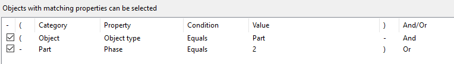
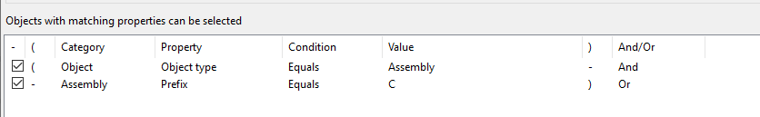

# Set Selection Filter

## What this extension does
This extension selects objects in your Tekla model based on a preconfigured setup in "Object Group - Selection Filter". The shortcut for this window in Tekla is Ctrl + G.

## Configuration
- Configure the field "Selection filter name" to select a selection filter.
- The selection filter has to be really  specific: 
    For example, to select parts from phase 2, you have to specify that you want to select an object with the type 'Part' and a Part with Phase '2'. 
 
    To select assemblies with a 'C' prefix, you have to specify that you want to select an object with the type 'Assembly' and an Assembly with a Prefix 'C'. 
 