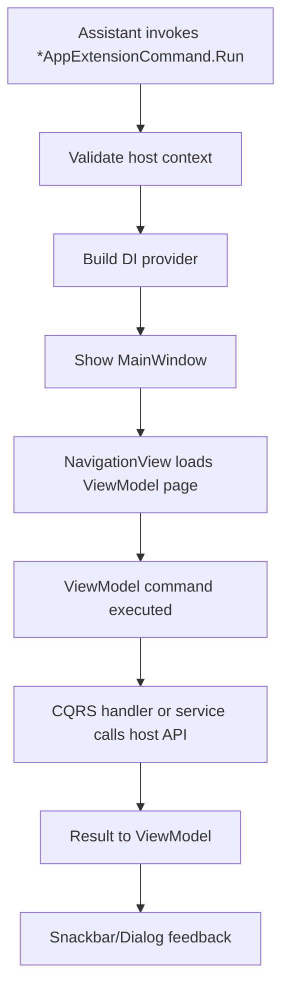

# App Extension Developer Guide

This guide covers shared architecture and implementation patterns for interactive App Extensions (modeless, app-style templates).

Use this guide together with:

- [Revit App Extension Guide](./PLATFORM_GUIDES/REVIT_APP_EXTENSION.md)
- [Tekla App Extension Guide](./PLATFORM_GUIDES/TEKLA_APP_EXTENSION.md)
- [Args Developer Guide](./ARGS_DEVELOPER_GUIDE.md)

## Architecture at a Glance

App Extensions are split into clear layers:

1. Host entrypoint layer
2. UI shell layer
3. View layer
4. ViewModel layer
5. Host operation layer (CQRS handlers or services)

This separation keeps host API code testable, keeps the UI responsive, and makes design-time UI development possible.



## When to Use App Extensions

Choose an App Extension when your extension needs one or more of the following:

- modeless UI with multiple actions
- richer interaction flows than a single run-return task
- MVVM pages/views/viewmodels
- host operations triggered from user actions over time

Choose an Automation Extension when the use case is mostly deterministic input -> execution -> result.

## End-to-End Runtime Flow

Most App Extensions follow this runtime shape:

1. `*AppExtensionCommand.Run(...)` is called by Assistant.
2. Command validates host context (for example active model/document).
3. Command builds a service provider and registers app services.
4. Command opens the modeless window.
5. ViewModels trigger host operations through handlers/services.
6. Commands return user feedback in dialogs/snackbars and keep UI responsive.

Keep command entry logic minimal. Push feature behavior into ViewModels + handlers/services.

### Minimal startup command example

```csharp
public class RevitAppExtensionCommand : IRevitExtension<RevitAppExtensionArgs>
{
	public IExtensionResult Run(IRevitExtensionContext context, RevitAppExtensionArgs args, CancellationToken cancellationToken)
	{
		var document = context.UIApplication.ActiveUIDocument?.Document;
		if (document is null)
			return Result.Text.Failed("Revit has no active model open");

		var provider = ServiceFactory.Create(context.UIApplication, services =>
		{
			services.RegisterAppServices(args);
		});

		WindowHandler.ShowWindow<MainWindow>(provider, context.UIApplication.MainWindowHandle);
		return Result.Text.Succeeded("Application was started");
	}
}
```

The command should only validate context and bootstrap the app. Feature logic belongs elsewhere.

## Recommended Project Structure

Typical folders and responsibilities:

- `*AppExtensionCommand.cs`: host entrypoint and window startup
- `Registrations.cs`: dependency injection registration
- `MainWindow.xaml` and `MainWindow.xaml.cs`: shell window and navigation bootstrap
- `Views/*`: user controls for each page
- `ViewModels/*`: state + commands for each page
- `CQRS/*` or `Services/*`: host API operations
- `Resources/ViewBindings.xaml`: ViewModel-to-View mapping

## Dependency Injection Pattern

Register app-level services once in `Registrations.cs`.

Common registrations include:

- args instance (`AddSingleton(args)`)
- shell window (`MainWindow`)
- page viewmodels (`HomeViewModel`, `AboutViewModel`)
- UI service abstractions (dialog/snackbar service)
- host operation layer (`CQRS` handlers or custom services)

Prefer constructor injection everywhere.

### Registration example

```csharp
public static class Registrations
{
	public static IServiceCollection RegisterAppServices(this IServiceCollection services, RevitAppExtensionArgs args, bool useDesignQueryHandlers = false)
	{
		services.AddSingleton(args);
		services.AddCqrs(typeof(Registrations).Assembly, useDesignQueryHandlers);

		services.AddSingleton<MainWindow>();
		services.AddSingleton<HomeViewModel>();
		services.AddSingleton<AboutViewModel>();

		services.AddSingleton<IContentDialogService, ContentDialogService>();
		return services;
	}
}
```

Tips:

- Register args as singleton so all ViewModels and handlers use the same runtime values.
- Register windows/viewmodels as singleton unless you need explicit per-instance behavior.
- Keep registration in one place to avoid hidden app wiring.

## Views and Navigation

Use a single shell window with a navigation host:

- `NavigationView` for page switching
- `TargetPageType` pointing to the ViewModel type
- snackbar/content dialog presenters in shell

Use `Resources/ViewBindings.xaml` so pages are created from ViewModel navigation.

### Main window shell example

```xml
<ui:FluentWindow x:Class="MyExtension.MainWindow"
				 xmlns="http://schemas.microsoft.com/winfx/2006/xaml/presentation"
				 xmlns:x="http://schemas.microsoft.com/winfx/2006/xaml"
				 xmlns:ui="http://schemas.lepo.co/wpfui/2022/xaml"
				 xmlns:viewModels="clr-namespace:MyExtension.ViewModels">

	<Grid>
		<ui:NavigationView x:Name="NavView" PaneDisplayMode="LeftFluent">
			<ui:NavigationView.MenuItems>
				<ui:NavigationViewItem Content="Home" TargetPageType="{x:Type viewModels:HomeViewModel}" />
				<ui:NavigationViewItem Content="About" TargetPageType="{x:Type viewModels:AboutViewModel}" />
			</ui:NavigationView.MenuItems>

			<ui:NavigationView.ContentOverlay>
				<ui:SnackbarPresenter x:Name="SnackbarPresenter" />
			</ui:NavigationView.ContentOverlay>
		</ui:NavigationView>

		<ContentPresenter x:Name="RootContentDialogPresenter" />
	</Grid>
</ui:FluentWindow>
```

### View binding dictionary example

```xml
<ResourceDictionary xmlns="http://schemas.microsoft.com/winfx/2006/xaml/presentation"
					xmlns:viewModels="clr-namespace:MyExtension.ViewModels"
					xmlns:views="clr-namespace:MyExtension.Views">
	<DataTemplate DataType="{x:Type viewModels:HomeViewModel}">
		<views:HomeView />
	</DataTemplate>
	<DataTemplate DataType="{x:Type viewModels:AboutViewModel}">
		<views:AboutView />
	</DataTemplate>
</ResourceDictionary>
```

## ViewModel Authoring Guidelines

ViewModels should own:

- UI state properties
- commands and command enablement
- user feedback orchestration (snackbar/dialog)

ViewModels should not own:

- direct host API transaction logic
- long-running host loops
- platform object lifecycle management

### Command Patterns

Common command styles from templates:

- `Do(...)` for local actions and service calls
- `Send<TQuery, TResult>(...)` for CQRS-driven operations
- `.If(...)` for input gating
- `.Handle(...)` for known error-to-UI handling

### ViewModel example using CQRS send

```csharp
public class HomeViewModel : RevitViewModelBase
{
	private readonly ISnackbarService _snackbarService;

	public string? CurrentDocumentTitle
	{
		get => Get<string?>();
		set => Set(value);
	}

	public HomeViewModel(ViewModelBaseDeps deps, ISnackbarService snackbarService)
		: base(deps)
	{
		_snackbarService = snackbarService;
	}

	public IFluentCommand LoadTitleCommand =>
		Send<GetDocumentTitleQuery, GetDocumentTitleQueryResult>()
			.Then(result =>
			{
				CurrentDocumentTitle = result.Title;
				_snackbarService.Show("Loaded", "Document title updated", Wpf.Ui.Controls.ControlAppearance.Success);
			});
}
```

### ViewModel example using service call

```csharp
public class HomeViewModel : ViewModelBase
{
	private readonly ITeklaService _teklaService;

	public string? ModelName
	{
		get => Get<string?>();
		set => Set(value);
	}

	public HomeViewModel(ITeklaService teklaService)
	{
		_teklaService = teklaService;
	}

	public IFluentCommand LoadModelNameCommand => Do(() =>
	{
		ModelName = _teklaService.GetModelName();
	});
}
```

## Host Operation Layer

You can use either of these patterns:

1. CQRS handlers (`IQueryHandler`, `ICommandHandler`) for explicit operation contracts.
2. Service classes (`ITeklaService`, `IRevitService`) for cohesive host APIs.

Use one primary pattern per feature area to keep maintenance simple.

### CQRS query handler example

```csharp
public class GetDocumentTitleQuery : IQuery<GetDocumentTitleQueryResult>;
public record GetDocumentTitleQueryResult(string Title);

public class GetDocumentTitleQueryHandler(RevitContext context)
	: IQueryHandler<GetDocumentTitleQuery, GetDocumentTitleQueryResult>
{
	public GetDocumentTitleQueryResult Execute(GetDocumentTitleQuery input, CancellationToken cancellationToken)
	{
		return new(context.Document?.Title ?? "No model is open");
	}
}
```

### CQRS command handler example

```csharp
public class DeleteSelectedElementsCommand;

public class DeleteSelectedElementsCommandHandler(RevitContext context)
	: ICommandHandler<DeleteSelectedElementsCommand>
{
	public void Execute(DeleteSelectedElementsCommand input, CancellationToken cancellationToken)
	{
		var doc = context.Document;
		if (doc is null)
			return;

		var ids = context.UIDocument!.Selection.GetElementIds();

		using var transaction = new Transaction(doc, "Delete selected elements");
		transaction.Start();

		foreach (var id in ids)
		{
			cancellationToken.ThrowIfCancellationRequested();
			doc.Delete(id);
		}

		transaction.Commit();
	}
}
```

### Service example

```csharp
public interface ITeklaService
{
	string GetModelName();
	int SetCommentOnSelectedObjects(string comment, CancellationToken cancellationToken);
}

public class TeklaService : ITeklaService
{
	public string GetModelName()
	{
		var model = new Model();
		return model.GetInfo().ModelName;
	}

	public int SetCommentOnSelectedObjects(string comment, CancellationToken cancellationToken)
	{
		var model = new Model();
		var selector = new Tekla.Structures.Model.UI.ModelObjectSelector();
		var selectedObjects = selector.GetSelectedObjects();

		int count = 0;
		while (selectedObjects.MoveNext())
		{
			cancellationToken.ThrowIfCancellationRequested();

			if (selectedObjects.Current is null)
				continue;

			if (selectedObjects.Current.SetUserProperty("comment", comment))
			{
				selectedObjects.Current.Modify();
				count++;
			}
		}

		model.CommitChanges();
		return count;
	}
}
```

## Design-Time App Run and Design Data

App templates support design-time/local app runs without a host model session.

### Design App Startup

Use `App.xaml.cs` to create sample args and start the app window with a design provider.

Revit template pattern:

- use `DesignServiceFactory.Create(...)`
- call `RegisterAppServices(..., useDesignQueryHandlers: true)`

### Design startup example (Revit template)

```csharp
public partial class App : Application
{
	public App()
	{
		var args = new RevitAppExtensionArgs
		{
			InitialComment = "Hello from the design project!"
		};

		var provider = DesignServiceFactory.Create(services =>
		{
			services.RegisterAppServices(args, useDesignQueryHandlers: true);
		});

		var hostWindow = new Window();
		var handle = new WindowInteropHelper(hostWindow).Handle;
		WindowHandler.ShowWindow<MainWindow>(provider, handle);
	}
}
```

### Design Query/Command Handlers

When using CQRS, add design handlers next to real handlers:

- `IDesignQueryHandler<TQuery, TResult>`
- `IDesignCommandHandler<TCommand>`

These handlers should return deterministic sample data quickly and never call host APIs.

```csharp
public class GetDocumentTitleDesignQueryHandler
	: IDesignQueryHandler<GetDocumentTitleQuery, GetDocumentTitleQueryResult>
{
	public GetDocumentTitleQueryResult Execute(GetDocumentTitleQuery input, CancellationToken cancellationToken)
	{
		return new("Design Model Title");
	}
}

public class DeleteSelectedElementsDesignCommandHandler
	: IDesignCommandHandler<DeleteSelectedElementsCommand>
{
	public void Execute(DeleteSelectedElementsCommand input, CancellationToken cancellationToken)
	{
		MessageBox.Show("Design mode: command executed. No model was modified.");
	}
}
```

### XAML Design Data

For view authoring:

- use `d:DataContext` with `d:DesignInstance`
- bind to real ViewModel types
- keep design mode rendering independent from host runtime dependencies

```xml
<UserControl x:Class="MyExtension.Views.HomeView"
			 xmlns:d="http://schemas.microsoft.com/expression/blend/2008"
			 d:DataContext="{d:DesignInstance Type=viewmodels:HomeViewModel}">
	<!-- View layout -->
</UserControl>
```

## Cancellation and Exception Policy

- Pass `CancellationToken` into cancellable operations.
- Use `ThrowIfCancellationRequested()` in long loops.
- Do not catch `OperationCanceledException`.
- Do not use `catch (Exception)`.
- Catch only specific expected exceptions you can turn into actionable UX.
- Let unexpected exceptions bubble up; Assistant handles unhandled exceptions.

### Practical pattern

```csharp
public async Task RunOperationAsync(CancellationToken cancellationToken)
{
	foreach (var item in _items)
	{
		cancellationToken.ThrowIfCancellationRequested();
		await ProcessItemAsync(item, cancellationToken);
	}
}
```

Good:

- check cancellation in long loops
- catch known host exceptions where you can provide better guidance

Avoid:

- catch (Exception)
- catching OperationCanceledException and converting it to failed result

## Keep Code Lean, Keep Docs Rich

Template code should stay concise. Put detailed rationale and workflows in documentation pages (this guide and platform app guides), not in large in-file comment blocks.

## Building a New Feature Page (Step by Step)

1. Create a new ViewModel in ViewModels.
2. Create a new View in Views and bind it to the ViewModel.
3. Add DI registrations for the ViewModel.
4. Add DataTemplate mapping in Resources/ViewBindings.xaml.
5. Add a NavigationView item in MainWindow.xaml using TargetPageType.
6. Implement host operations in CQRS handler/service.
7. Add design handler or design service behavior for UI-only development.
8. Verify commands handle cancellation and known failures correctly.

This path matches the Revit and Tekla app templates and scales for multi-page apps.
